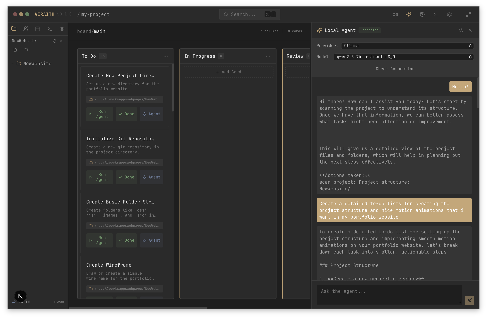

# VIRAITH IDE

**Observe. Compare. Build.**

VIRAITH IDE is an **AI-native desktop IDE** where **a Kanban card is the unit of work**: plan tasks, attach code context, and run an agent against that scope. Built with **Tauri (Rust)** + **Next.js/React (TypeScript)**.

---

## Screenshot (no deployment needed)



---

## What it does

- **Kanban workflow**: boards, columns, cards, drag & drop.
- **Card context**: attach folders/files to a card for scoped work.
- **Local agent panel**: connect to a local provider (e.g. Ollama / LM Studio) and work inside the IDE.
- **File explorer + editor**: browse project files and edit them in-app.
- **Git integration**: “ghost branches” for isolated changes per task.

---

## CV highlights — real engineering problems solved

This project intentionally demonstrates practical, production-style problem solving:

- **Secrets & repo hygiene**
  - Prevented accidental credential leaks by keeping real keys in `.env.local` (gitignored) and committing placeholders in `.env.example`.
  - Purged previously committed secrets from git history (history rewrite) and documented safe practices.
- **Security hardening for desktop apps**
  - Reduced Tauri permission surface area by removing overly broad capabilities (`fs:read-all`, `fs:write-all`, `shell:allow-execute`) and tightening CSP `connect-src`.
  - Removed an unused shell plugin to reduce attack surface and dependency weight.
- **Dependency vulnerability response**
  - Used `pnpm audit`, identified high/moderate advisories, and upgraded to patched versions.
- **Tooling / build reliability**
  - Ensured the repo builds cleanly (Next.js export + Rust `cargo check`) and added a working ESLint v9 flat config for consistent CI linting.
- **UX & state architecture**
  - Modular React UI + Zustand stores, with IDE-style panels and workflows designed for long sessions.

---

## Issues encountered & fixed (selected)

These are the kinds of “real project” problems I intentionally worked through (and fixed) while building VIRAITH:

- **Accidentally committed an API key** → moved secrets to `.env.local`, committed placeholders in `.env.example`, and purged the key from git history.
- **Security advisories in dependencies (`pnpm audit`)** → upgraded to patched versions (e.g. Next.js) and verified the lockfile resolves to non-vulnerable releases.
- **ESLint v9 config breakage** (missing `eslint.config.*`) → added an ESLint flat config wired to `next/core-web-vitals` so CI linting is deterministic.
- **Desktop-app permission scope too broad** → removed “allow everything” Tauri capabilities (like `fs:read-all` / `fs:write-all`) and tightened CSP networking.
- **Local agent connectivity pain** (localhost timeouts / CORS / provider differences) → added explicit connection checks and provider configuration UX in the UI.

---

## Tech stack

**Frontend**
- Next.js + React + TypeScript
- Monaco editor
- Zustand + TanStack Query
- Tailwind CSS

**Backend (Tauri/Rust)**
- Tauri 2
- SQLite (rusqlite)
- git2

---

## Getting started

### Prerequisites

- Node.js 20+
- pnpm
- Rust toolchain (Tauri)

### Run dev

```bash
pnpm install
pnpm tauri:dev
```

### Build

```bash
pnpm tauri:build
```

---

## Environment variables

See `.env.example` for variable names.

- Put real keys in `.env.local` (gitignored)
- Do not commit API keys/tokens

## Security

See [SECURITY.md](SECURITY.md).

---

## License

MIT — see [LICENSE](LICENSE).
